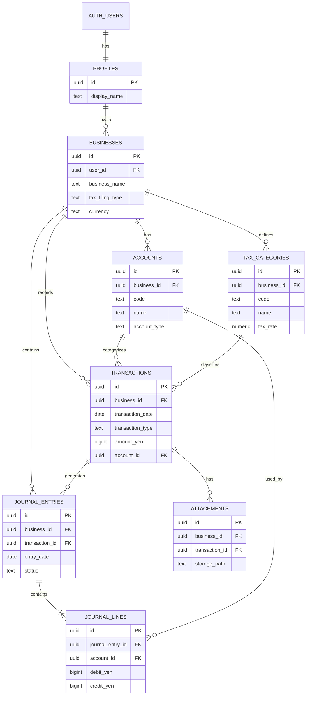

# ER図

```mermaid
erDiagram
    AUTH_USERS ||--|| PROFILES : has
    PROFILES ||--o{ BUSINESSES : owns
    BUSINESSES ||--o{ ACCOUNTS : has
    BUSINESSES ||--o{ TAX_CATEGORIES : defines
    BUSINESSES ||--o{ TRANSACTIONS : records
    BUSINESSES ||--o{ JOURNAL_ENTRIES : contains
    TRANSACTIONS ||--o{ JOURNAL_ENTRIES : generates
    JOURNAL_ENTRIES ||--|{ JOURNAL_LINES : contains
    ACCOUNTS ||--o{ JOURNAL_LINES : used_by
    ACCOUNTS ||--o{ TRANSACTIONS : categorizes
    TAX_CATEGORIES ||--o{ TRANSACTIONS : classifies
    TRANSACTIONS ||--o{ ATTACHMENTS : has

    PROFILES {
      uuid id PK
      text display_name
    }
    BUSINESSES {
      uuid id PK
      uuid user_id FK
      text business_name
      text tax_filing_type
      text currency
    }
    ACCOUNTS {
      uuid id PK
      uuid business_id FK
      text code
      text name
      text account_type
    }
    TAX_CATEGORIES {
      uuid id PK
      uuid business_id FK
      text code
      text name
      numeric tax_rate
    }
    TRANSACTIONS {
      uuid id PK
      uuid business_id FK
      date transaction_date
      text transaction_type
      bigint amount_yen
      uuid account_id FK
    }
    JOURNAL_ENTRIES {
      uuid id PK
      uuid business_id FK
      uuid transaction_id FK
      date entry_date
      text status
    }
    JOURNAL_LINES {
      uuid id PK
      uuid journal_entry_id FK
      uuid account_id FK
      bigint debit_yen
      bigint credit_yen
    }
    ATTACHMENTS {
      uuid id PK
      uuid business_id FK
      uuid transaction_id FK
      text storage_path
    }
```

注：Supabase Authの `auth.users` はSupabaseが管理するテーブル。初期SQLでは `profiles` から参照する。
